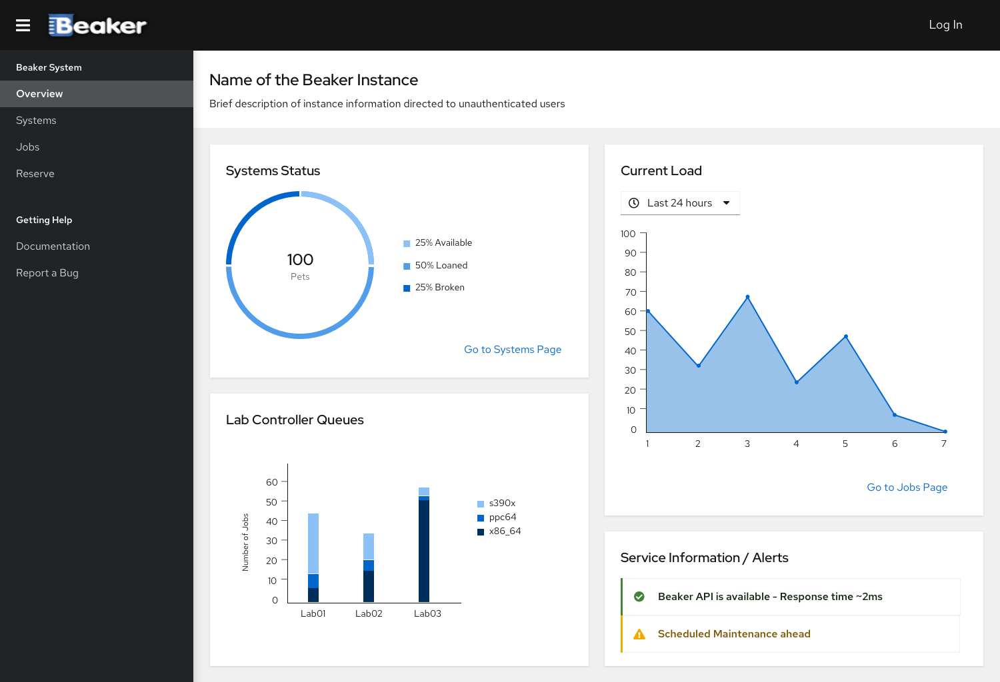

# Main Dashboard

Designs for the landing Dashboard of beaker.

## Unauthenticated user

When any unauthenticated user opens the beaker web interface, a dashboard is shown with main information about:

- State of the machines in the instance - available, loaned, broken, reserved - Link to systems page
- Number of Jobs/Recipies that are being executed - Link to Jobs page
- Available Lab Controllers and queue size

