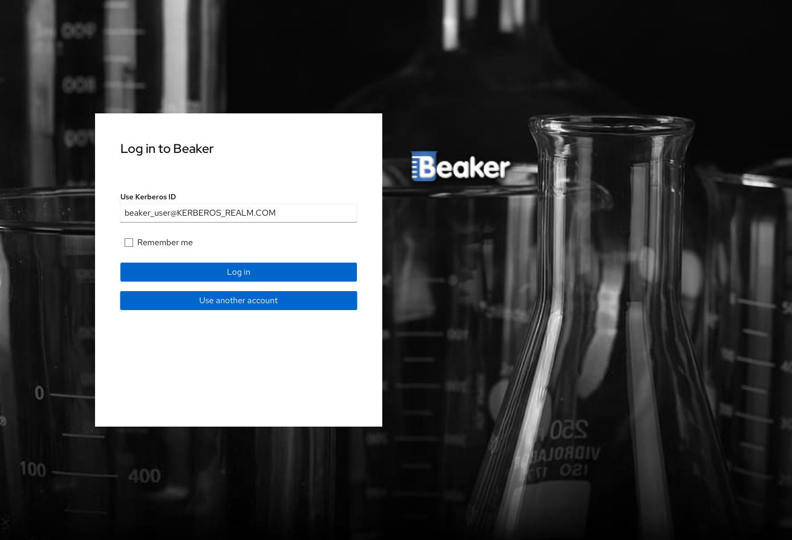
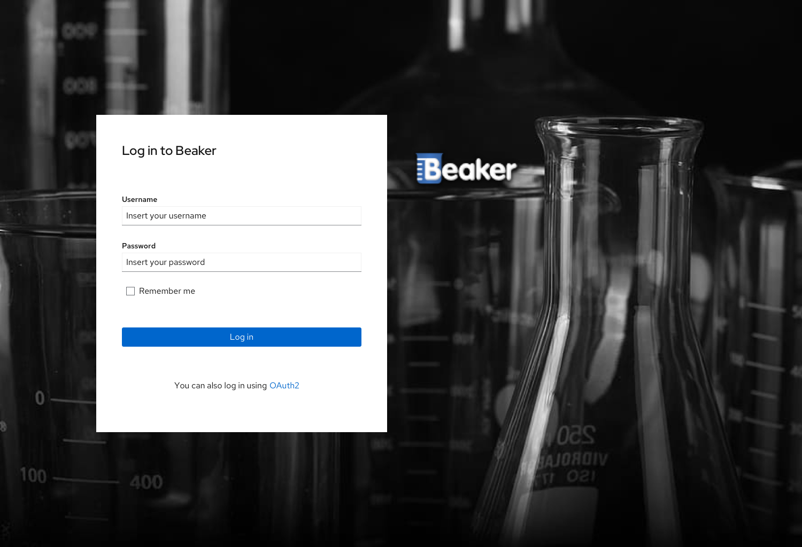
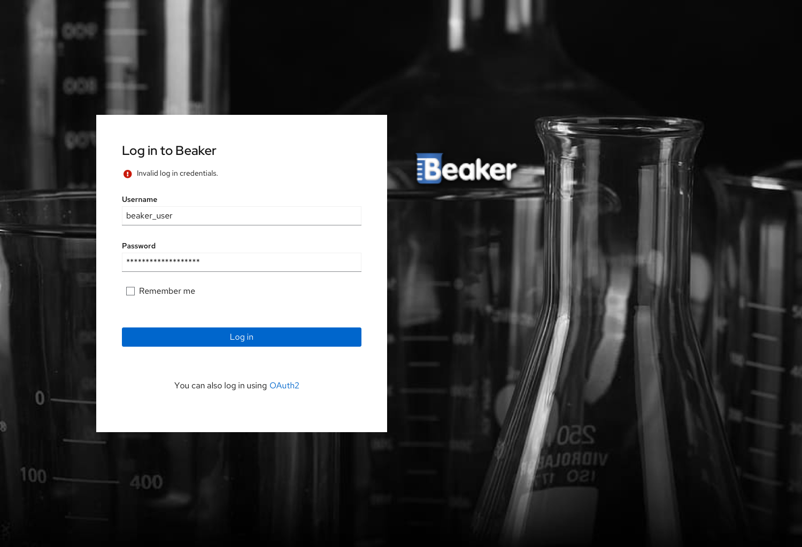
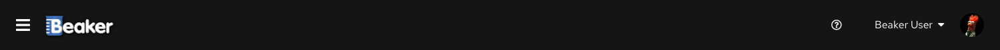

# Login Screen

Unauthenticated users will be redirected to the login screen.

Direct authentication with Kerberos ticket should be available. If a user has a valid ticket, the authentication screen will
show the Kerberos principal which will be used to authenticate against Beaker.
The user can click 'Log In' to perform the authentication using the ticket.

For those who do not have any form of automatic authentication configured or for those who click the 'Use another account'
button in the Kerberos login screen, a login card will be shown asking for username and password.

If the user inserts an invalid combination of username and password, an error will appear in the card informing something went wrong.

If the user inserts a valid combination of username and password, or accepts the Kerberos credentials, the login will
succeed and the name of the user will be visible, with the profile picture, in the upper right corner of the screen.

