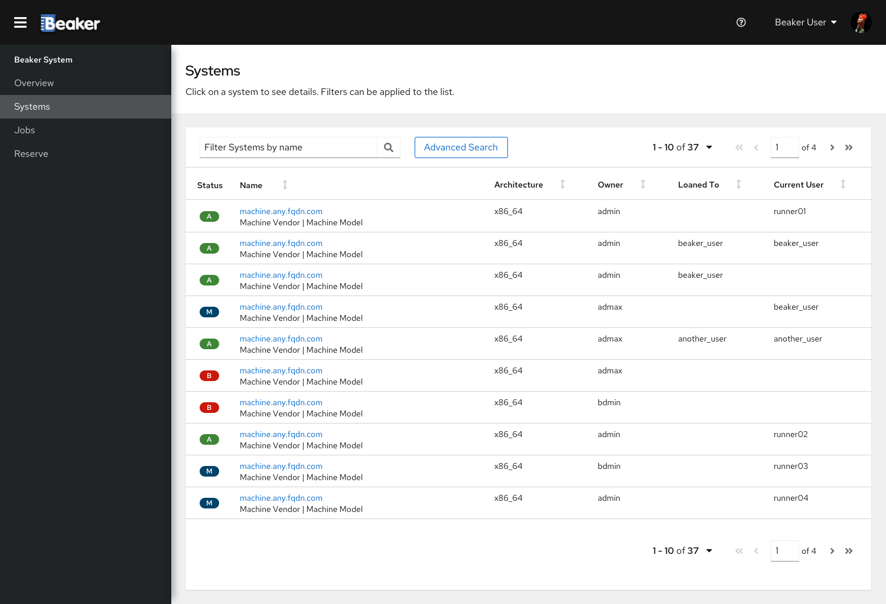
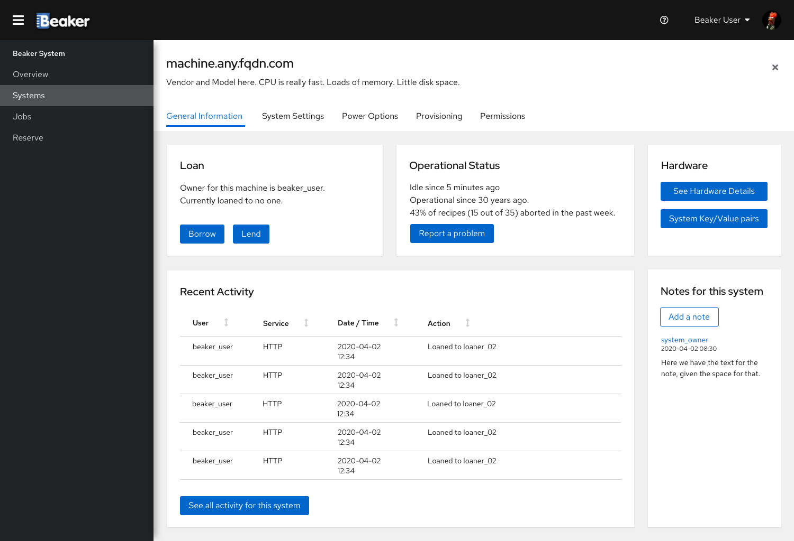
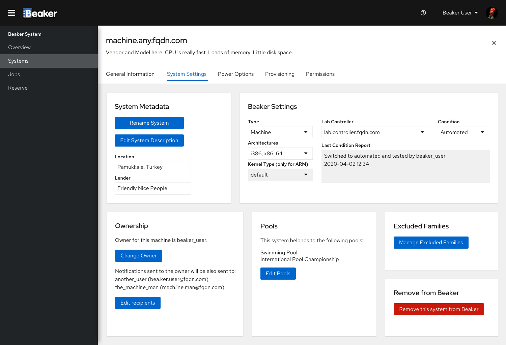
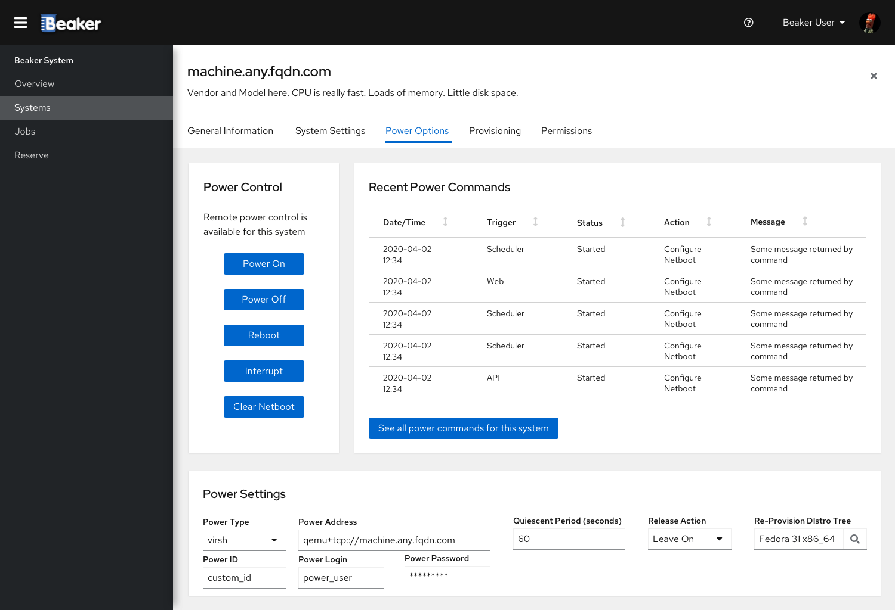
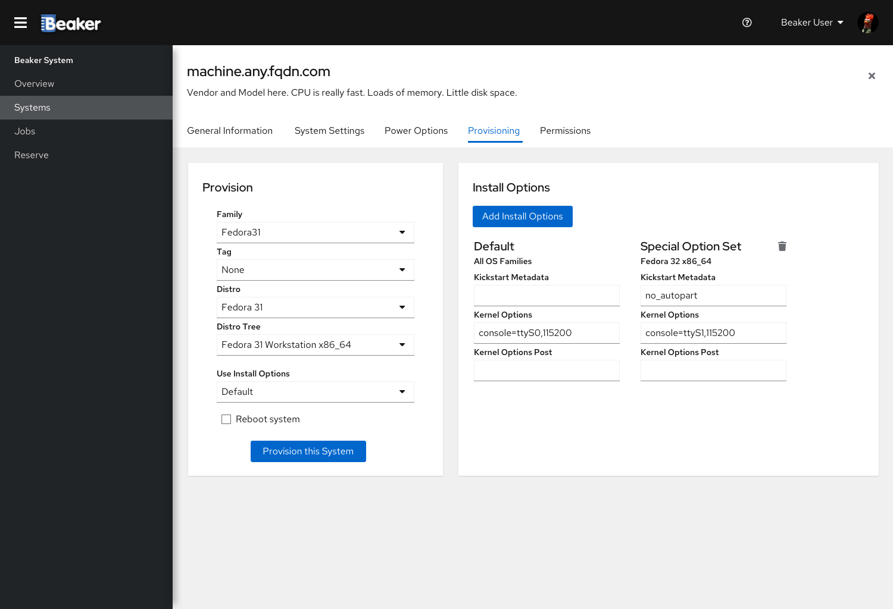
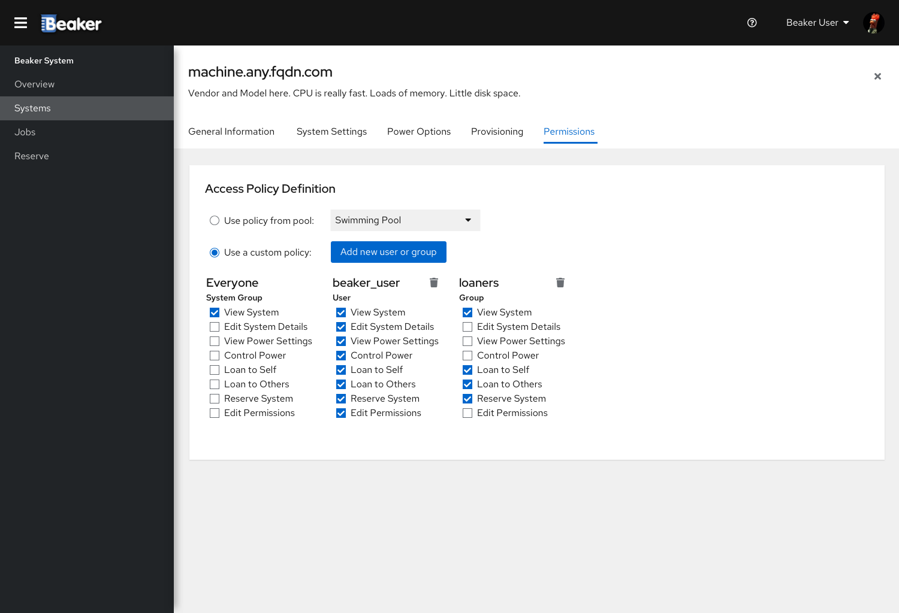

# Systems Screen

When a user clicks the "Systems" option in the main menu, the Systems screen shows a table with the systems in Beaker.
The table contains 10 results per page. There are navigation commands which can be used to go through the pages.

There is a filter bar which can be used to search for specific systems by name. Other filtering options will be available
through "Advanced Search".

The table contains 5 fields:
- Name: name of the system in Beaker, with the machine vendor and model
- Architecture: architecture(s) supported in this system
- Owner: user who owns the system in Beaker
- Loaned To (optional): User who got the system through loan, if any
- Current User: User who is running something in the system, if any

## System details - General Information

When a user clicks a system in the table presented in the Systems screen, the details for that system are presented.
Clicking the 'x' in the top-right corner of the screen sends the user back to the Systems screen.
A horizontal submenu groups all of the configuration and information for the system by subject.

The first details screen has the general information about the system. It contains 5 cards:
- Loan: informs who is the owner for this system and if is there any active loan. Also has buttons for borrowing
the system or lending it to someone, given the current user has the proper permissions to do so.
- Operational Status: has the current status for this system and the amount of aborted recipes in the past week. Also has
a "Report Problem" button, allowing the current user to inform the machine owner of any problem that may have happened.
- Hardware: Has a button to show the hardware details for this system and a button to show the key/value pairs defined
for the system.
- Notes: notes about the system, written by anyone with permissions to do so.
- Recent Activity: small report of the recent activity in the system. The last 5 activities are shown. There is a button
which allows the user to see all the activity for the system.

The recent activity table has 4 fields:
- User: name of the user who triggered / executed the activity
- Service: shows through which service (command line, web interface) the activity was created
- Date / Time: timestamp for the activity
- Action: Description of the activity and its effects

## System details - System Settings

When a user clicks "System Settings" in the horizontal menu, the main settings for the machine are presented. Settings
can be changed if the current user has permissions to do so.

The System Metadata card has options to edit the system name and labels such as description, location and lender.

The Ownership card has the username of the system owner and a button to change the owner. Right after there is an editable
list of users, besides the owner, who get notifications for this system.

The Pools card has a list of pools this system belongs to, with a button to edit the list.

The Excluded Families card has only one button, leading to the Excluded Families configuration (if done the way it is
today, doesnt fit in a card.)

The main Beaker Settings can be defined in the appropriate card. Type and architecture of the system can be defined there,
as well as the Kernel type if it is an ARM system. It also has the Lab Controller the system is attached to. 

There is a Condition dropdown which defines the current status for this system (Automated, Manual or Broken). If the status
for a system is changed, the user needs to write down why it is changing. The text and timestamp will be displayed as the
Last Condition Report. Beaker itself can change this status and update this text.

The last card is Remove from Beaker. It has a button to completely remove the system from Beaker.

## System details - Power Options

When a user clicks "Power Options" in the horizontal menu, all the information and configuration related to power is
shown in the screen. 

The "Power Control" card will tell if the system power can be controlled remotely and will have buttons to power the
system on and off, reboot it, interrupt and clear netboot.

A table with the 5 most recent power commands is also shown. There is a button for the user to see all of the power
history for the machine. The table has 4 fields:
- Trigger: identifies how the power command was issued
- Action: the command itself
- Status: Current status of the command with corresponding timestamp
- Message (optional): message returned by the command call, if any

The "Power Settings" card will let the user set the power configuration for the system, as address, protocol, ID, username,
password, etc.

## System details - Provisioning

When the "Provisioning" option is selected in the horizontal menu, there will be two cards in the screen.

One of the cards will have the options to provision the system with a specific distro from the library. The user will be
able to select the family, tag, distro and tree as well as a set of Install Options to provision the system. A checkbox
may be selected to reboot the system.

Install Options can be defined in the second card. The "default" set of options will always be available, for all families
and architectures, with specific KS metadata and Kernel options for the installation. The user may click the "Add" button
to create customized sets of options for specific families and / or architectures supported by the system, and edit them
afterwards. Clicking the trash can icon for a set of options excludes it.

## System details - Permissions

When the "Permissions" option is selected in the horizontal menu, a card is shown with the specific permissions for the
machine. There are two main options: apply the policy according to a previously defined pool or apply a custom policy.

If the custom policy is selected, a default group called "Everyone" is created. More users and/or groups may be added
by clicking an "Add" button.

For every user / group defined in the policy, all specific permissions will be shown with checkboxes. Marking a checkbox
grants the permission and unmarking it removes the permission. Clicking the trash can icon for a user / group removes it
from the policy.

